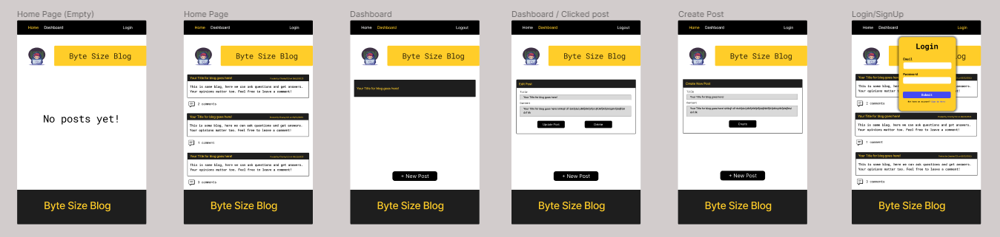
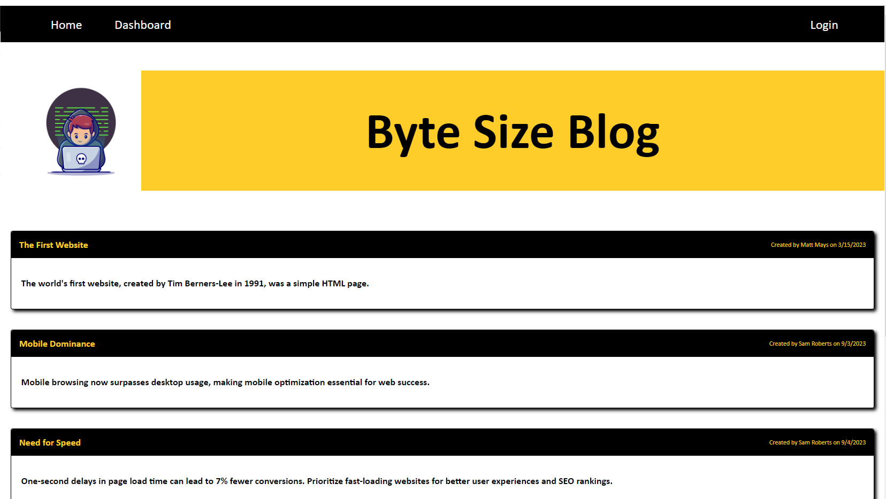
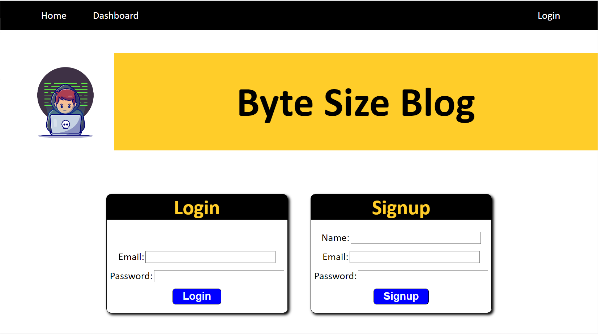
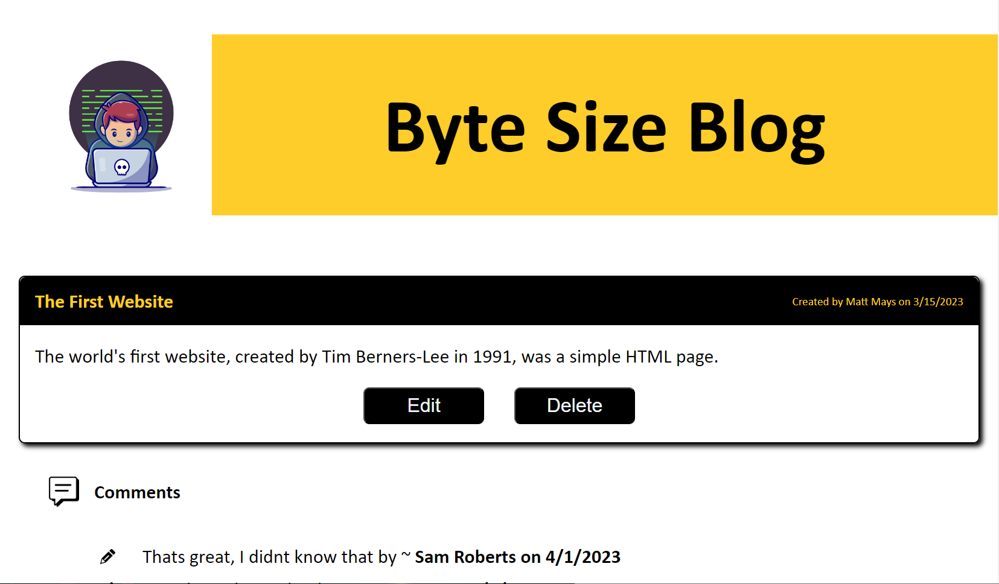

# Byte Size Blog - CMS-Style Tech Blog Site

Byte Size Blog is a CMS-style blog site designed for developers and tech enthusiasts. It provides a platform for you to publish articles, blog posts, and share your thoughts and opinions on various tech-related topics. Whether you're a seasoned developer or just starting your journey in the tech world, Byte Size Blog is the perfect place to connect with like-minded individuals and showcase your expertise.

## Table of Contents

- [User Story](#user-story)
- [Acceptance Criteria](#acceptance-criteria)
- [Features](#features)
- [Mock up](#mock-up)
- [Screen Shots](#screenshots)
- [Installation](#installation)
- [Usage](#usage)
- [Contributing](#contributing)
- [License](#license)
- [Credits](#credits)
- [Questions](#questions)
- [Deploy](#deploy)

## User Story

As a developer who writes about tech, you want a CMS-style blog site so that you can publish articles, blog posts, and your thoughts and opinions.

## Acceptance Criteria

Byte Size Blog aims to fulfill the following acceptance criteria:

When you visit the site for the first time, you will be presented with the homepage, which includes existing blog posts (if any have been posted). The homepage will also feature navigation links for the homepage and the dashboard, as well as the option to log in.

Clicking on the homepage option in the navigation will take you to the homepage.

Clicking on any other links in the navigation will prompt you to either sign up or sign in.

When you choose to sign up, you will be prompted to create a username and password.

Clicking on the sign-up button will save your user credentials, and you will be logged into the site.

Revisiting the site at a later time and choosing to sign in will prompt you to enter your username and password.

When you are signed in to the site, you will see navigation links for the homepage, the dashboard, and the option to log out.

Clicking on the homepage option in the navigation will take you to the homepage, where you will be presented with existing blog posts that include the post title and the date created.

Clicking on an existing blog post will present you with the post title, contents, post creator’s username, and date created for that post. You will also have the option to leave a comment.

Entering a comment and clicking on the submit button while signed in will save the comment, and the post will be updated to display the comment, the comment creator’s username, and the date created.

Clicking on the dashboard option in the navigation will take you to the dashboard, where you will be presented with any blog posts you have already created. You will also have the option to add a new blog post.

Clicking on the button to add a new blog post will prompt you to enter both a title and contents for your blog post.

Clicking on the button to create a new blog post will save the title and contents of your post, and you will be taken back to an updated dashboard with your new blog post.

Clicking on one of your existing posts in the dashboard will allow you to delete or update your post and will take you back to an updated dashboard.

Clicking on the logout option in the navigation will sign you out of the site.

If you are idle on the site for more than a set time, you will be able to view posts and comments, but you will be prompted to log in again before you can add, update, or delete posts.

## Features

User Authentication: Securely sign up, sign in, and log out of the site.
Homepage: Explore existing blog posts on the homepage.
Dashboard: Manage your posts using the user-friendly dashboard.
Blog Posts and Comments: Create, read, update, and delete your blog posts. Engage in discussions by leaving comments on posts.
Idle Session Handling: For added security, you will be prompted to log in again after being idle for a set time.

## Mock up

## Screenshots

## Installation

To run Byte Size Blog locally, follow these steps:

Clone the repository to your local machine.

Navigate to the project directory.

Run the following command to install the required dependencies:

npm install
Set up your MySQL database by creating a .env file in the project root directory and adding your database configuration:
DB_NAME=your_database_name
DB_USER=your_database_user
DB_PASSWORD=your_database_password

Run the following command to create the database tables:
DROP DATABASE IF EXISTS bytesizeblog_db;
CREATE DATABASE bytesizeblog_db;

Start and seed the application:
npm run seed
npm start

Access the application in your web browser at http://localhost:3001

## Usage

Sign up for an account to start using Byte Size Blog.
Create, read, update, and delete your blog posts.
Leave comments on posts to engage in discussions with other users.
Explore existing blog posts on the homepage.
Manage your posts using the user-friendly dashboard.
Log out when you're done.

## Contributing

Contributions are welcome! If you would like to contribute to this project, please follow these guidelines:

Fork the repository.
Create a new branch for your feature or bug fix.
Make your changes and ensure they work as expected.
Commit your changes and provide descriptive commit messages.
Push your branch to your forked repository.
Open a pull request, and describe the changes you've made.

## License

This project is licensed under the MIT License - see the LICENSE file for details.

## Credits

logo used

{{! <a href="https://www.freepik.com/free-vector/hacker-operating-laptop-cartoon-icon-illustration-technology-icon-concept-isolated-flat-cartoon-style_11602236.htm#query=cartoon%20programmer%20tiny&position=0&from_view=search&track=ais">Image by catalyststuff</a> on Freepik }}

## Questions

If you have any questions or need further assistance with Byte Size Blog, please feel free to contact me via email.

Thank you for using Byte Size Blog, and happy blogging!

## Deploy 

Heroku Deploy:  https://byte-size-blog-29657a568883.herokuapp.com/

Github Repo:  https://github.com/Terence-A/ByteSizeBlog#deploy
